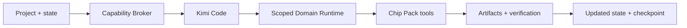

# Industrial Agent Harness

English · [简体中文](README.zh-CN.md)

[](#preview-scope)
[](LICENSE)
[](package.json)

**An AI workbench for engineering projects, with scoped tools and verifiable results.**

Industrial Agent Harness connects local projects, Kimi Code, professional software and engineering evidence through a desktop workbench and a headless CLI. Domain Packs provide the knowledge, tools and verification methods for each field.

> [!IMPORTANT]
> **Developer Preview.** The project is a Workbench MVP with a first persistent RTL verification path. APIs, Pack interfaces and runtime behavior are still evolving. This README describes the current source tree; published preview archives follow their own release notes.

[Quick start](#quick-start) · [Domain Packs](#domain-packs) · [Viewers](#viewers) · [Documentation](#documentation) · [License](#license)

## What you can do

- **Work from a real project.** Bind a local directory to a domain, keep multiple chats, resume sessions and inspect execution logs.
- **Configure Agents.** Choose a built-in, Pack-provided or custom role; manage instructions, tools, registered Skills and subagents, set a project default and select the role before a local chat starts. Existing chats retain their role snapshot. [Agent configuration and limits](doc/agent-profiles.md).
- **Load relevant knowledge and tools.** The Capability Broker progressively discloses Skills and tool schemas, then enforces the selected scope at execution.
- **Use project guidance.** Discover `.skill/`, `.skills/` and standard project Skill directories, and load project `AGENTS.md` through Kimi's native mechanism. See the [compatibility audit](doc/kimi-native-compatibility-audit.md) for remaining limitations.
- **Keep engineering evidence.** The RTL runtime records inputs, actions, artifacts, verification and checkpoints. Input changes invalidate current evidence; interrupted work remains visible after restart.
- **Inspect artifacts in the workbench.** View waveforms, netlists, layouts, KiCad designs, Godot assets and ordinary project files.
- **Automate and extend.** Use the CLI's JSON Lines events, the Node SDK or stdio JSON-RPC; build independent Domain Packs with complete Skill resources and installation integrity checks.

Kimi Code owns the agent loop, conversation history and compaction. Harness supplies project context, scoped engineering tools and evidence. A completed agent turn or a successful process exit does not establish engineering acceptance.

The first implemented industrial path is:



## Quick start

Use **Node.js 24+** and **pnpm 11.1.3**. Kimi Code 2.1.1 is bundled; Agent execution needs model API settings. Chip MCP separately needs **uv** and **Python 3.13**. Protected agent execution is available on **macOS with Apple Silicon (arm64)** and **Linux x86-64 with bubblewrap**; see [preview scope](#preview-scope) before trying other platforms.

```sh
git clone https://github.com/Zhiman-BJ/industrial-agent-harness.git
cd industrial-agent-harness
npm install --global pnpm@11.1.3
pnpm install --frozen-lockfile
```

### 1. Explore the CLI without a model

```sh
pnpm cli run \
  --project-dir ./examples/chip-sobel \
  --domain chip \
  --task "Inspect netlist signals" \
  --scope-only
```

This prints the registered capability scope and disclosure trace. It needs no API key or native engineering tools, and does not execute or verify the design.

### 2. Start the desktop workbench

```sh
pnpm --filter @industrial-agent-harness/desktop setup:kimi
pnpm dev
```

Open **Settings → Model API** to configure your model, then add a local project and select its domain. Open the right-hand workspace to browse files. File previews work without a model API key.

Select the server's **API format** independently of the Kimi agent kernel. Official MiniMax Chat Completions uses OpenAI-compatible settings; thinking controls vary by model and protocol. See [tested model API behavior and remaining gaps](doc/model-api-compatibility.md).

**The layout button** switches between the classic split view and a shared chat/file/Viewer tab strip. `+` browses project files; single-click reuses a preview tab, while double-click or the pin keeps it. Switching retains drafts and Viewer state. The window fits the display work area and uses tabs automatically when narrow. [Responsive layouts](doc/desktop-layouts.md).

**Settings → Language** switches between English, 简体中文 and Follow system immediately. The app remembers your preference; switching preserves drafts, running tasks and viewer state. Harness controls and dialogs are localized; project files, conversations, tool output and embedded third-party interfaces retain their original content. See [desktop languages](doc/desktop-languages.md).

The setup command verifies the bundled **Kimi Code 2.1.1** runtime; Desktop and CLI share the authenticated Server API integration. No separate Python Kimi installation is needed. See the [migration record](doc/kimi-code-migration.md) for history, diagnostics and compatibility. Layout viewing additionally needs KLayout Python: run `pnpm --filter @industrial-agent-harness/desktop setup:layout` or set `KLAYOUT_PYTHON`.

### 3. Verify the real RTL path on macOS with Apple Silicon

After setting up Kimi above, prepare Verilator, a C++ toolchain and the Chip Python environment:

```sh
brew install verilator
(cd "$(node scripts/pack-source.cjs chip-pack)/eda-harness" && uv sync --frozen --no-dev --python 3.13)
HARNESS_REQUIRE_CORE_NATIVE=1 pnpm run test:industrial-core
```

The tests run real RTL simulation and check assertions, waveforms, failure handling, installed Pack integrity and restart recovery. Model responses come from a controlled local provider, so these tests do not spend model API credits or measure model capability. See the [industrial runtime guide](doc/p0-industrial-runtime.md) for real-task setup and evidence boundaries.

For Linux x86-64 Chip users, the [one-command installer](releases/chip-linux-installer-v0.1.0-preview.3.md) prepares private runtimes, the protected Agent and the EDA image.

Prefer a packaged preview? Browse [GitHub Releases](https://github.com/Zhiman-BJ/industrial-agent-harness/releases) and follow that version's instructions. [Headless installation](apps/cli/README.md#github-release-安装) and [domain CLI packages](doc/domain-cli-downloads.md) cover checksums and external dependencies. Existing archives do not acquire newer source features automatically.

The 1.0.1-beta.1 local Apple Silicon desktop candidate lists all five domains. Chip, PCB, Godot and CAD are optional bundled Packs, including when no online catalog is configured; CUDA stays visible with its remote prerequisites and unavailable desktop-package status. Selecting PCB, Godot or CAD automatically prepares the pinned official KiCad 10.0.6, Godot 4.7.2 or FreeCAD 1.1.4 in the user Pack store. These managed tools need no shell commands or environment setup; Chip still needs its external Python, compiler and EDA/PDK environment. Core bundles Kimi Code 2.1.1; model API configuration remains separate. The installer shows size estimates, progress, cancellation and recovery, then each domain’s actual readiness. See [installation experience and release limits](doc/install-experience.md) and [CAD installation acceptance](doc/macos-cad-distribution.md). This local candidate is not a signed public release or a qualified Core OTA update.

## Domain Packs

| Domain                                                                                                                          | Available in this preview                                                                                                                                     | Dependencies and limits                                                                                                                                         |
| ------------------------------------------------------------------------------------------------------------------------------- | ------------------------------------------------------------------------------------------------------------------------------------------------------------- | --------------------------------------------------------------------------------------------------------------------------------------------------------------- |
| [Chip](https://github.com/Zhiman-BJ/industrial-domain-packs/tree/b9759342cace66df0be0c4559b7c24fb28ea07d9/packs/chip/README.md) | EDA knowledge and tool registration; a persistent, declared RTL verification path; waveform, netlist and layout viewers                                       | Python and Verilator for the Core path; other EDA flows need their own tools, images or PDKs. Broader EDA execution still needs Runtime integration.            |
| [CUDA](doc/cuda-domain-pack.md)                                                                                                 | Two remote Compiler/Evaluator MCP Servers, kernel optimization Skill and canonical native evidence                                                            | Developer configuration with both authenticated endpoints; fixed RTX 4090 AXPBY scope; private native workers remain external. No advertised desktop bundle.    |
| [PCB](doc/pcb-godot-runtime.md)                                                                                                 | Public typed rectangular board/footprint edits, native DRC and independent task verification; KiCad viewers                                                   | macOS Apple Silicon; packaged Desktop prepares official KiCad 10.0.6 and its Python automatically. Bounded mechanical layout, no electrical/manufacturing signoff or private actor dependency.    |
| [Godot](doc/pcb-godot-runtime.md)                                                                                               | Typed scene transforms/BoxMesh edits, native import/readback/frame verification; source and Web Export viewers                                                | macOS Apple Silicon; packaged Desktop prepares Godot 4.7.2 automatically. Explicit structural properties, no unrestricted gameplay QA; Web Export keeps separate dependencies. |
| [CAD · FreeCAD](doc/freecad-domain-pack.md)                                                                                     | Parametric sketches, pads, holes, boolean solids and versioned parameter/outline edits; FCStd/STEP/STL export, independent geometry readback and OCCT viewing | Packaged Desktop prepares FreeCAD 1.1.4 automatically on macOS arm64. Bounded native feature types; no mechanical strength or manufacturing acceptance.         |

Build your own Pack with the [Pack authoring tutorial](doc/pack-authoring.md). Domain code lives in Packs; the shared Core and Broker remain independent of concrete domains. Registration, a rendered preview or a successful native smoke check does not imply a complete industrial workflow. The [PCB/Godot native profiles](doc/pcb-godot-runtime.md) close the shared Runtime gap for their explicit first tasks; broader engineering support remains outside those profiles. The [earlier release audit](doc/release-readiness-20261007.md) is historical evidence.


### Task results

Tools register compact result rows automatically through the shared task service, with attached reports grouped under Supporting results and file/check details expanded on demand; CLI emits the same groups and file references. Open the main result, inspect native files/exports, and read checks for the recorded version. Explicit replacements preserve history; parallel designs stay visible. One supported read-only preview can open once after a foreground request settles, provided you have not changed files/tabs/chats. History, background work, failures and ambiguous choices never take focus. Partial outputs and changed files are labeled. Agent `select_result` is optional. FreeCAD generation → consecutive edits → checks → cards → OCCT viewing was exercised on macOS arm64 from source, separately from a real-model demonstration; no new installer/platform qualification. [Behavior, contract and evidence](doc/task-results.md).

Reading chat history requires no execution setup, including for unfinished remote projects. Saved result events read existing facts without loading Packs, and share file validation within that read; later reads and file opening recheck content.

The owner maintains [proposed declarations and an expansion plan for all five domains and six Packs](https://github.com/Zhiman-BJ/industrial-domain-packs/blob/cf72a46b6b4ba927b091ded71b2d52d227db0351/docs/result-presentation-plan.md). Only FreeCAD's domain producer is connected to task results today; the other result integrations remain planned. The current consumer retains the CUDA support already integrated on main.

## Viewers

Viewers open from the active project's file tree. They share zoom, Fit and fullscreen controls and leave source files and verification results unchanged. Drag the workspace divider or use its arrow/Home/End keys to resize the panels; double-click to reset. OCCT retains model proportions during resizing and fullscreen. [Local release acceptance](doc/release-readiness-20261007.md).

Harness-owned Viewer controls follow **Settings → Language** (English / 简体中文). Switching keeps zoom, selection and other view state; embedded upstream interfaces keep their own language. Languages and Desktop/Viewer translations share one [configuration](apps/desktop/i18n.config.json); see [language scope and maintenance](doc/desktop-languages.md).

| Viewer                                               | Inputs                                                                                                       | Viewing features and limits                                                                                                                                                                                                                                                                                                                                                                                                                                                                                                                                                                                 |
| ---------------------------------------------------- | ------------------------------------------------------------------------------------------------------------ | ----------------------------------------------------------------------------------------------------------------------------------------------------------------------------------------------------------------------------------------------------------------------------------------------------------------------------------------------------------------------------------------------------------------------------------------------------------------------------------------------------------------------------------------------------------------------------------------------------------- |
| [Chip layout](doc/viewer-eda-reference.md)           | GDS/GDSII, OAS/OASIS                                                                                         | Viewport rendering and layer selection; requires KLayout Python.                                                                                                                                                                                                                                                                                                                                                                                                                                                                                                                                            |
| [Netlist](doc/viewer-eda-reference.md)               | Yosys `write_json` output                                                                                    | netlistsvg diagrams in a worker; ordinary JSON uses the document viewer.                                                                                                                                                                                                                                                                                                                                                                                                                                                                                                                                    |
| [Waveform](doc/viewer-eda-reference.md)              | VCD, FST, GHW                                                                                                | Signal and timeline inspection with bundled Surfer WASM.                                                                                                                                                                                                                                                                                                                                                                                                                                                                                                                                                    |
| [KiCad](doc/kicad-viewer.md)                         | `.kicad_pcb`, `.kicad_sch` and project subsheets                                                             | Local KiCanvas layer, net and symbol inspection; read-only 2D viewing, no KiCad install required.                                                                                                                                                                                                                                                                                                                                                                                                                                                                                                           |
| [Godot Web Export](doc/godot-viewer.md)              | Matching HTML/JS/WASM/PCK files                                                                              | Run, pause, step and inspect scene nodes; requires a single-threaded export with the Viewer Bridge.                                                                                                                                                                                                                                                                                                                                                                                                                                                                                                         |
| [Images and sprites](doc/godot-assets-viewers.md)    | PNG/JPEG/WebP; `.sprite.json` plus images                                                                    | Pan, sampling modes, atlas selection and cropping previews; no Godot runtime required.                                                                                                                                                                                                                                                                                                                                                                                                                                                                                                                      |
| [Animation](doc/godot-assets-viewers.md)             | Supported `.tres`/`.tscn` and atlas animations                                                               | Playback and frame stepping for bounded SpriteFrames/Sprite2D formats; does not run the Godot engine.                                                                                                                                                                                                                                                                                                                                                                                                                                                                                                       |
| [Engineering files](doc/engineering-file-viewers.md) | Godot scenes/resources/scripts; KiCad libraries/rules; Gerber/drill; STEP/VRML and selected 3D/audio formats | Structured, manufacturing-layer and media previews; limited geometry and semantics, not an editor or manufacturing acceptance.                                                                                                                                                                                                                                                                                                                                                                                                                                                                              |
| [CAD · OCCT](doc/freecad-domain-pack.md)             | STL; Pack-generated FCStd/STEP with hash-checked BREP/STL and optional native sketch companions              | Official OCCT 7.9.2 AIS/V3d WebGL2: shaded faces, CAD edges, X/Y/Z capped sections, an explicit Measure button for face/edge picking and BREP length/diameter/area/minimum-distance annotations directly on the model (separate single-object size and two-object minimum-distance modes, without a measurement sidebar); native sketch geometry, dimensions and constraint highlighting. Shared navigation/fullscreen with stable proportions on resize; local WASM, WebGL2 required. Read-only, nominal geometry measurements without tolerance or engineering acceptance. macOS arm64 Electron verified. |
| [Documents](doc/document-viewers.md)                 | CSV/TSV, JSON, JSONL/NDJSON, Markdown, TXT/LOG                                                               | Tables, structures, record browsing and text search; bounded UTF-8 input, no formulas or embedded HTML execution.                                                                                                                                                                                                                                                                                                                                                                                                                                                                                           |

Exact format lists, file limits and rendering dependencies are documented in the linked guides. New Viewer integrations must update both language READMEs and follow the [Viewer integration contract](AGENTS.md#viewer-integration-contract).

Try the [Sobel chip project](examples/chip-sobel/README.md), [LED board](examples/pcb-led/README.md), [Godot playground](examples/godot-viewer/README.md) or [document samples](examples/document-viewers/README.md). These are viewing examples; Godot Web Export must be generated separately. They are not engineering acceptance evidence.

## Documentation

| Start here                                                                                   | Details                                                                                                                             |
| -------------------------------------------------------------------------------------------- | ----------------------------------------------------------------------------------------------------------------------------------- |
| [Documentation index](doc/README.md)                                                         | Architecture, product decisions and module guides; most detailed documentation is currently in Chinese.                             |
| [CLI](apps/cli/README.md) · [Node SDK](doc/sdk.md)                                           | Tasks, streaming events, chat recovery, cancellation and stdio JSON-RPC.                                                            |
| [Pack authoring](doc/pack-authoring.md) · [Versioned contracts](doc/contracts-versioning.md) | Independent Pack development, resources, compatibility and canonical industrial facts.                                              |
| [Current delivery and validation](doc/harness-quality-three-tracks.md)                       | Implemented scope, exercised tests and remaining work. Historical architecture proposals are not implementation claims.             |
| [Paired evaluation baseline](doc/benchmark-baseline.md)                                      | Native Kimi/Harness comparison, frozen inputs and independent verification. Formal model success-rate and cost results are pending. |
| [Security](SECURITY.md) · [Third-party notices](THIRD_PARTY_NOTICES.md)                      | Execution boundaries, reporting and component provenance.                                                                           |

## Development and contributions

Issues and pull requests are welcome. Include the source commit, platform, affected domain, a minimal reproduction and redacted logs. For code changes, read [AGENTS.md](AGENTS.md), keep domain behavior inside Packs and verify the relevant real execution path.

```sh
pnpm run test
pnpm run test:architecture
pnpm run test:release
pnpm run format:check
```

The [Harness CI gate](.github/workflows/ci.yml) runs shared-package and packaged CLI regressions on Linux x64/arm64, macOS arm64 and Windows x64, desktop installation on macOS/Windows, and the industrial Core path on Apple Silicon and Linux x86-64, including the actual installed Chip CLI. [CI regression coverage](doc/ci-regression.md) documents dependencies, retained evidence and explicit coverage gaps; a skipped test does not establish support. Report security issues through the process in [SECURITY.md](SECURITY.md).

## Preview scope

- **Platforms:** desktop build and first-run CI targets are macOS with Apple Silicon (arm64) and Windows x64. Intel Mac is temporarily unsupported; no Intel installers or Pack catalog targets will be published. Support can resume after installation and runtime validation on an Intel test machine. Signed installers and real upgrades still need separate acceptance.
- **Protected execution:** macOS uses Seatbelt; Linux x86-64 uses bubblewrap/seccomp and requires unprivileged user namespaces. Windows protected Agent execution remains unavailable.
- **Tool compatibility:** legacy domain MCP writes remain blocked; all domains have approved workspace edits and declared task execution. Registered external MCP uses audited host Runtime calls; the separate Computer Use plugin remains unavailable.
- **Engineering acceptance:** the first Core path verifies declared RTL/testbench assertions and evidence. Coverage sufficiency, physical signoff and other domains' complete workflows are pending.
- **Packaging and evaluation:** local unsigned desktop checks and controlled model fixtures are documented. Signed releases, end-to-end cross-platform qualification and formal paid model comparisons remain separate work.

See the [validation record](doc/harness-quality-three-tracks.md) for exact tested versions and results.

## License

Project-owned contributions are licensed under the **[MIT License](LICENSE)**, including the authorized EDA Harness and EDA Harness demo code.

Bundled renderers, fonts, dependencies and separately installed tools retain their own licenses. The complete distribution is not MIT-only; consult [THIRD_PARTY_NOTICES.md](THIRD_PARTY_NOTICES.md) and the relevant provenance records. External private PCB resources are not granted a public license by this repository.

Shared initialization, editing, declared local/Docker tasks and external MCP are documented in [Shared workspace](doc/shared-workspace.md). Packaged consumer CI exercises empty-project creation, failing checks and repair; specialized tools, models and sign-off remain Pack/project responsibilities.

Workspace approvals show file diffs, declared commands and external arguments. `doctor` checks execution prerequisites without a model; workspace selection and explicit local dependency roots are described in [Shared workspace](doc/shared-workspace.md). External MCP preserves connection state within the current chat process and fails visibly if that state is lost.

### Built-in remote execution (internal trial)

Projects can choose this computer or Zhiman Remote, with explicit file upload review and compact job status. Desktop and CLI share the Remote Runtime; qualified domain tools execute in the existing fixed CPU sandbox pool. Public endpoint and sign-in defaults remain unset. The macOS Apple Silicon client → H200 Linux RTL path is verified; public access and other remote domains are pending. See [remote execution](doc/remote-execution.md).

CLI and Desktop now share the Harness task application; domain metadata, Skills and implementations come from one immutable Domain Packs release. See [consumer migration and validation](doc/shared-task-and-pack-consumption.md).

PCB and Godot professional Runtime Actions now have bounded macOS Apple Silicon native profiles, maintained in the pinned Domain Packs package. The current 1.0.1-beta.1 source pins Domain Packs 0.5.2 at `b9759342cace66df0be0c4559b7c24fb28ea07d9` and prepares the declared official native applications through the generic Pack Manager. See [profile, dependencies and acceptance](doc/pcb-godot-runtime.md); other platforms and remote execution remain unqualified.
