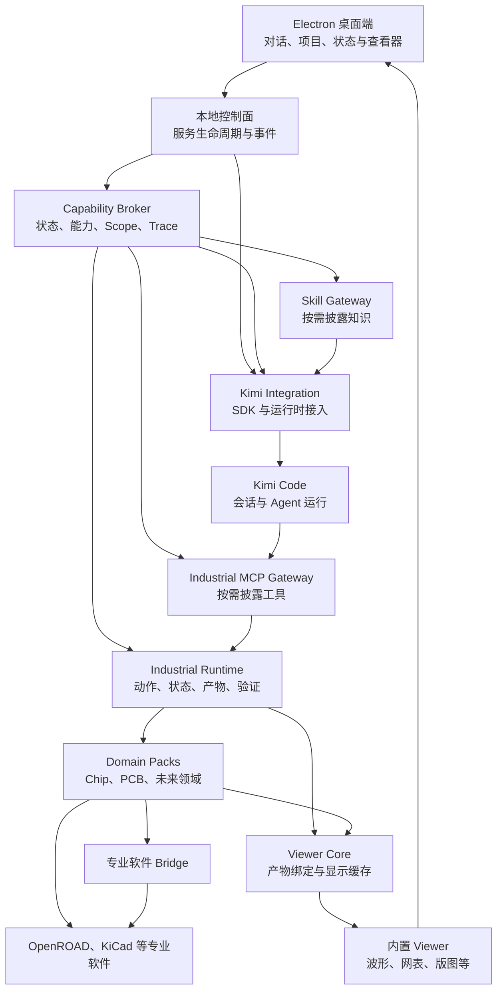

# 系统架构

Industrial Agent Harness 的稳定部分是工业环境：项目与领域状态、能力、动作、产物、验证和历史轨迹。第一阶段使用 Kimi Code 作为指定 Agent Kernel，由 Electron 提供桌面工作台。芯片与 PCB 是首批参考领域，后续领域通过 Domain Pack 扩展。

## 总体关系



这是目标分层图，不代表图中服务和接口已经实现。控制面与 Broker 是逻辑职责；是否在同一进程部署，待最小链路验证后确定。Kimi 的具体连接方式也须以固定 SDK 版本的实测结果为准。

## 职责

| 组成 | 拥有的数据与行为 |
| --- | --- |
| Kimi Code | Agent Loop、会话、对话上下文、压缩、工具调用及其原生能力 |
| Kimi Integration | 启动和连接、会话控制、事件转换、权限响应、有限的 Industrial Context 传递 |
| Capability Broker | Domain State 获取、Capability 解析、Skill Batch、Tool Scope、Session Scope 与 Disclosure Trace |
| Industrial Runtime | Action 生命周期、状态变化、产物来源、Verification、Checkpoint 与 Trajectory |
| Industrial MCP Gateway | 统一的领域工具入口、能力发现、工具范围与调用转发 |
| Domain Pack | 某领域的状态提供者、能力声明、skills、tools、verifiers、viewers 与 bridges |
| Viewer Core 与内置 Viewer | 按产物身份选择显示方式、生成派生显示数据；在桌面端展示关键工程产物 |
| Electron 桌面端 | 用户交互、项目选择、对话和工程证据的展示；通过受限 IPC 访问本地服务 |

Kimi Integration 可以使用 Kimi 专属事件和会话语义。工业侧的契约保持独立，不把 Kimi 类型传入 Core，也不把芯片或 PCB 规则写入 Core。当前不建设跨 Agent 的通用运行时适配层；将来增加其他 Agent 时，再为其建立独立接入。

## 工业任务闭环

```text
项目与 Domain State → 当前任务 → Capability 解析
→ Skill Batch + Tool Scope → Kimi 决策与调用
→ 工业 Action → 新 Artifact / State → Verification
→ 接受、修复或回退 → Checkpoint / Trajectory
```

Action 的执行状态、验证结论和用户对结果的接受是不同信息。查看器使用有来源的 Artifact；界面不得根据进程退出码自行判定工程目标已通过。

## 上下文与扩展边界

Harness 提供结构化的 Industrial Context，例如领域、阶段、当前产物、问题和指标。Kimi 管理对话历史、token 预算及压缩。Skill 描述工作方法，MCP Tool 暴露可执行操作；两者由同一 Capability 关联，但分别披露和管理。

扩展点分为 Tool、Bridge、Viewer 和 Verifier。Tool 执行动作，Bridge 连接运行中的专业软件，Viewer 展示产物和状态，Verifier 依据领域规则评价结果。Viewer 的内部渲染与外部专业软件打开使用不同路径；CAD、Godot 等复杂软件在内部展示关键产物，不重建完整工作台。详细边界见 [Viewer 层设计](viewer-layer.md)。优先使用软件提供的原生 API、CLI 或 IPC；交互界面自动化仅在合适场景下补充。

## 仓库映射

已落实的目录：`apps/desktop`、`packages/agent-kimi`、`packages/contracts`、`packages/domain-skills`、`packages/domain-runtime`、`packages/domain-mcp`、`packages/viewer-core`、`packages/viewer-builtin`。Viewer Core 已有初始类型契约；三组 EDA Viewer 已接入桌面端。Kimi SDK 固定为 `0.1.8`，开发环境 CLI 固定为 `1.51.0`，模型连接参数通过桌面设置传入。Domain Runtime 与 Domain MCP 目录目前主要是边界声明。`apps/desktop/viewer-host` 是桌面 Viewer 容器的结构占位。

计划新增的职责包括本地控制面、Capability Broker、Domain Pack SDK、Bridge/Verifier 扩展点、参考领域和打包流水线。具体拆包以实现时的依赖边界为准，不为匹配一张目录图提前建立空包。
