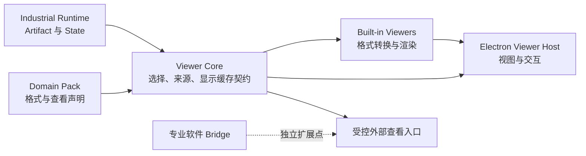

# Viewer 层设计与约束

Viewer 层让用户在 Harness 内直接检查工程产物，并保持产物来源、运行状态和验证结论可追溯。它服务于人工理解与跨视图分析，不替代专业软件的完整工作台。本文定义 Viewer Core、内置渲染器和 Electron Viewer Host 的边界；三种 EDA Viewer 已接入桌面 MVP。

## 展示策略

| 场景 | Harness 内部展示 | 专业软件承担 |
| --- | --- | --- |
| 芯片设计 | 波形、Yosys 网表、报告、DEF/GDS 局部版图、层与对象选择 | 完整版图编辑、工艺设置、复杂时序或物理调试界面 |
| PCB 设计 | 原理图或板图关键视图、层、网络、DRC 标记、制造产物预览 | 完整布线、封装编辑、设计规则配置 |
| CAD/CAE | 模型缩略图或受限 3D 预览、剖面图、网格、仿真结果与报告 | 参数化建模、装配、求解器配置和专业后处理 |
| Godot 等复杂 UI 应用 | 场景快照、资源预览、运行截图或视频、日志与测试结果 | 完整场景编辑器、动画工作台和运行调试器 |

这些是产品目标，不代表格式支持已经实现。是否内置某种格式，由可获得的解析器、许可、跨平台能力、性能和真实产物验证共同决定。无法可靠内置时，提供可追溯的关键产物预览或明确的外部打开入口。

## 组成与依赖

- **Viewer Core** 只处理查看器描述、能力选择、产物绑定、状态和派生显示缓存。它不依赖 Kimi、MCP、Electron 或具体领域。
- **Built-in Viewers** 实现被选格式的读取与显示转换。复杂或不可信格式在受限进程中解析，向 UI 返回有限的显示数据。
- **Desktop Viewer Host** 负责标签页、视口、图层、时间轴、选择与加载反馈。Renderer 通过窄 IPC 读取显示数据。
- **Domain Pack** 声明本领域的产物类型、配套输入和 Viewer 贡献，但不能向 Electron Renderer 注入任意 HTML 或脚本。
- **Bridge** 负责连接正在运行的专业软件；外部应用启动也是受控动作。两者均不被内置 Viewer 隐式执行。

`packages/viewer-core` 已有初始类型契约，`packages/viewer-builtin/src` 是三种 EDA Viewer 的正式代码路径。`apps/desktop/viewer-host` 承载桌面接入。具体 API 会在真实产物链路中继续稳定。

## 最小查看契约

Viewer 请求至少引用 `projectId`、`artifactId`、`stateId` 或 `runId`、查看模式及必要的配套产物 ID。来源记录至少包含产物类型、内容哈希、生产 Run/State、转换器身份和显示参数。调用者不能只传任意绝对路径，也不能从“最新文件”推断历史页面的来源。

Viewer 描述至少说明：稳定 ID、可处理的产物类型、所需配套输入、支持的平台、显示模式、资源上限及可用性。能力探测须区分“未检查”“可用”“不可用”；缺少本机图形环境或软件不等于产物无效。

查看状态需分别表达：等待、加载中、已显示、格式不支持、缺少配套输入、转换失败、资源超限和外部启动失败。外部程序的 `LAUNCHED` 只表示进程已启动；内部 `RENDERED` 只表示显示数据已生成，两者都不改变 Verification。

## 安全和证据边界

1. **只读原始证据**：Viewer 从已登记的 Artifact 读取经身份校验的数据。交互产生的视口、图层、光标和筛选状态只属于 Viewer 会话。需要修改设计时，走明确的 Action/Tool 路径。
2. **派生数据独立**：缩略图、索引、切片、几何瓦片和 SVG 视为显示缓存。缓存键包含全部源哈希、配套产物哈希、转换器版本和参数；缓存失效或失败不能改变原始 Artifact、Run 或验收。
3. **来源清晰**：同一视图的多个产物必须明确是否属于同一 State、Run 或设计对象。跨视图联动只能基于显式映射或可说明的推断；无映射时显示缺失，不虚构网络、信号或几何对应关系。
4. **受限解析**：对大文件采用分页、时间窗口、层级或视口加载。限制输入大小、内存、耗时、输出大小和并发；解析失败给出可诊断错误。SVG、HTML、项目文件和插件内容不得以可执行脚本直接进入 Renderer。
5. **受控外部应用**：打开 KLayout、KiCad、CAD 或 Godot 等应用需显式用户动作或明确授权；传入核验后的导出副本和参数数组，不拼接 shell 命令。应用启动、文件加载和工程验证分别记录。
6. **权限与隔离**：Electron Renderer 不持有任意文件系统、Node 或进程权限。第三方 Viewer 贡献不能直接执行 UI 代码；若将来支持交互插件，需独立沙箱、来源隔离与受限消息接口。
7. **平台一致性**：每个 Viewer 报告真实的平台可用性。不能因 macOS 可用就宣称 Linux/Windows 可用；无内部查看能力时可展示元数据和明确的降级路径。

## 首批验证顺序

先以真实报告、波形和 Yosys 网表验证只读产物链路及来源显示，再接 DEF/GDS 的按视口展示和 PCB 关键产物预览。复杂 CAD/Godot 先做产物卡片、截图或导出结果的查看链路，不以重建完整编辑器作为验收条件。每项格式都需分别验证正常、缺配套文件、错误格式、超限、跨项目引用和缓存失效场景。

现有 EDA Harness 的 `viewer_capabilities`、`open_viewer` 和 Silicon Lens 的波形、网表、GDS 视图可作为设计参考；实现需重新确认许可证、格式兼容性与三平台行为。

## 已迁入的 EDA 参考实现

[EDA Viewer 参考实现](viewer-eda-reference.md) 介绍正式代码路径中的版图、网表和波形 Viewer：KLayout `LayoutView` 按视口渲染，netlistsvg 对 Yosys JSON 生成 SVG，Surfer WASM 在隔离的本地页面中加载 VCD。三者作为实际使用的内置 Viewer，也为新领域接入提供参考。

桌面 Host 目前只将项目文件树中选中的受支持文件登记为 Artifact ID，计算并显示 SHA-256，打开时复核内容哈希。普通文件继续显示文本预览；Viewer 测试 fixture 不会作为产品入口出现。项目、Run、State 的持久绑定及完整来源链仍待 Domain Runtime 接入。Surfer 的底层 WASM 是未修改的官方站点快照；桥接使用的部分消息命令被上游标为不稳定接口，升级时需单独验证。
